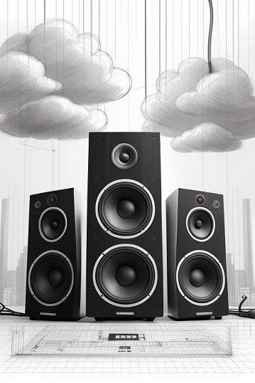

>[!TIP]
>Já aviso: Eutherpe é sobre as nuvens, onde para tornar a experiência interessante,
>tudo dependerá de você e da sua bagagem musical. Ao usar Eutherpe, esqueça telas, pois,
>a sua Música precisa voltar a ser a principal estrela nesse ritual tão banalizado...
>Sim, escutar hoje em dia (inclusive música) é algo bem atípico. Sejamos a resistência!
>Escutemos! 
>:fist_raised: :vulcan_salute: :metal: :headphones: :notes: :dancer: :guitar: :drum:

---

# Eutherpe 

`Eutherpe` é um tipo de fiação etérea para jukebox. Isso é a base do `Euther-Pi` que é um projeto `faça-você-mesmo` para
trazer de volta o ritual prazeroso de escutar música longe de um super comportado, óbvio e sem-graça sistema computacional.
A essência aqui é evitar ficar atrelado a telas e botões, subscrições, propaganda, sugestões enxeridas e blá-blá-blá. Vamos
parar com todo esse ruído de merda e ouvir as músicas que amamos. Esse é o convite que `Eutherpe` e `Euther-Pi` fazem
a você. Com `Eutherpe` nós somos capazes de criar o equivalente a um serviço de streaming pessoal e `self-hosted` para tocar
música em casa. Tudo que você precisa fazer é alimentar `Eutherpe` com sua biblioteca `MP3/4` e conectá-la a uma caixa de
som/`headphone` `bluetooth` e por fim, ir se divertir.

> [!NOTE]
> Você não precisa pôr `Eutherpe` dentro de um `Raspberry Pi` mas isso é uma tarefa muito bacana de fazer e eu desconfio que
> você iria adorar ter esse "dispositivo de jukebox etérea" (`não grampeada`) em casa. Se você ficou interessada(o), você pode
> seguir todos os passos de como fazer isso no repo do `Euther-Pi`.
>
> Entretanto, para início de conversa, eu sugeriria você conhecer todos os detalhes sobre `Eutherpe` começando por [aqui](doc/MANUAL-PT.md).
>
> Se você vomita ao ouvir a palavra `PulseAudio` (desculpa!) ou se você treme ao ouvir `PipeWire` ou `WirePlumber`,
> relaxe! Aqui o negócio é ficar com o simples, pois o simples é menos problemático:
> `ALSA`, `Bluez-ALSA` e acabou! Isso é o que você tem aqui.

Divirta-se! :wink:

-- Rafael

---

"- Oh! Huh! English please..." Okay...

`Eutherpe` is a kind of `ethereal` jukebox wiring. This is the base of `Euther-Pi` what is a `diy` project for bringing back
the pleasant ritual of listening to music outside from a flat well-behaved computer system. The essence here is avoid being
attached to screens and buttons, subscriptions, advertisements, nosy suggestions and, blah-blah-blah. Let's stop all this shitty
noise and listening to the tunes that we love. This is the invite of `Eutherpe` and `Euther Pi`  do for you. With `Eutherpe` we are
able to make an equivalent of a personal `self-hosted` music streaming service to play music at home. All you just do is feeding
`Eutherpe` with your `MP3/4` library, connect it to a `bluetooth` speaker/headphone and go have fun.

> [!NOTE]
> You do not need to build up `Eutherpe` into a `Raspberry Pi` but it is a very neat task to do and I hope you would love to have
> this nice little `ethereal` jukebox (not tapped) device at your home. If you are interested, you can follow up all steps to do it
> at `Euther-Pi` repo.
>
> However, firstly I would suggest you to know all single thing about `Eutherpe` by starting from [here](doc/MANUAL-EN.md).
>
> If you throw up hearing someone saying `PulseAudio` (sorry!) or you cringe when hearing `PipeWire` or `Wireplumber`,
> relax! Here the business is to be simple, because simple is less buggy: `ALSA`, `Bluez-ALSA` and period! It is what you got here.

Enjoy! :wink:

-- Rafael
