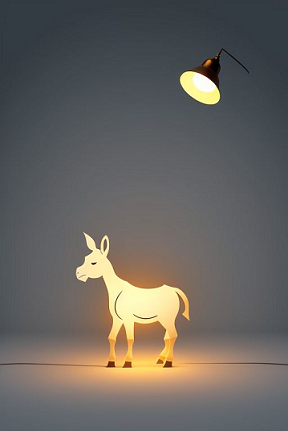

# Bad ideas avoider

I met a programmer that liked boast:

>In `software` everything is possible!!!!

I always bothered when listening to him naïve declaration and, I used to mentally answer him
in the following way:

>Just like in life, in `software` there are many things that you `CAN` do but only a few
>you really `MUST` do... And I am not even talking about P vs. NP...

Well, do not exist more doomed place of bad ideas than `IT`. I made up my mind write this text
seeking to eliminate any incredible idea that will deviate from the main goal of this software:
`unf_ck the act of listening to music that nowadays is so f_cked`... given the quantity of
pointless trinkets added to a ritual that should stick with simpleness. The main star on it must
be *your* `Music`.

Follow the table right below and check on if your idea is not quite near to something listed
there. If near, give up trying merge things here. **Thanks but no thanks!**

Nonetheless, the project is `opensource`. Do not wanting your idea here does not mean that you
cannot implement it, *you only cannot merge this idea here*. Do you want to get a `fork` from
`Eutherpe` and diverge from `upstream`? Go for it, freedom is everything, only **respect the
license, my intellectual property and of other eventual collaborators**. Do not `fork` the
repo, remove all references to work of other people, to sound like you do it all by yourself.
This is deplorable and unethical. No parasitims [sic], please!

## Thanks but no thanks!

|**Hall of bad ideas and beyond...**|
|:------------------:|
|[Let's track the quantity of times a song listening in order to figure out people's preferences](#lets-track-the-quantity-of-times-a-song-listening-in-order-to-figure-out-peoples-preferences)|
|[Let's create a way of people share in social media what they are listening](#lets-create-a-way-of-people-share-in-social-media-what-they-are-listening)|
|[Let's build up playlists automatically](#lets-build-up-playlists-automatically)|
|[Let's put psychedelic visualizators that reacts with sounds](#lets-put-psychedelic-visualizators-that-reacts-with-sounds)|
|[Let's put a slider to reposition the song playback](#lets-put-a-slider-to-reposition-the-song-playback)|
|[What about spectrum analyzers to detect the music pulse?](#what-about-spectrum-analyzers-to-detect-the-music-pulse)|
|[What about connectivity with streaming services?](#what-about-connectivity-with-streaming-services)|
|[What about use stats?](#what-about-use-stats)
|[Ads?](#ads)|

## Let's track the quantity of times a song listening in order to figure out people's preferences

Notice a thing out: The whole `web` nowadays (2024) is (de)constructed under this binary, stupid, childish
like/unlike. Persons, human beings, functional adults are complex creatures when talking about
preferences. One day they are feeling like eating sweetmeats and other days salt foods and still
others they will throw up any kind *AND IT IS ALRIGTH*. Stop thinking that the World is so simple,
because it is not.

There are tunes that people really love and that have deep meaning to them but that they do not
listen to these tunes every single day. The fact of being rarely listen do not make a tune
less beloved. Indeed, this rarer aspect maybe can make a tune more special. Did you understand
how this silly reductionism of only considering everything that is so much is so mistaken and
naïve?

What you would be implementing it would be a suggestion tapering based on those peaks of obsessions
that almost everyone have. You know, that periods that a person start listening to a kind of
music and someday they talk:

>"- I fed up listenning to this shit, I go listening to other things, but this trinket only insist on suggesting me this crap..."

Human beings are complex and the best way of avoid annoying them is letting them alone.

The base idea here is: provide a infrastructure for people with strong personality be able to
actively select what they are wanting to listen to **and it is enough**.

`Eutherpe` do not support people without personality, it is serious, it is `by-design`.

[`Back`](#thanks-but-no-thanks)

## Let's create a way of people share in social media what they are listening

Okay. Let's deconstruct it in most tacit way possible: create a way to a person tell on a little
platform to everyone: "- hey people TAKE A LOOK in what I am LISTEN TO"...

Do you yell from your window what you are listening to to your neighborhood by expecting a
"uhu!", "congrats", "thaaaat's right"? You like a cuddle, do not you?

Imagine if you toilet would have this feature... I am afraid of you, really!

[`Back`](#thanks-but-no-thanks)

## Let's build up playlists automatically

Silly thing. If the person is lazy enough to actively select what she/he want to listen to,
it means that she/he is not wanting to listen to anything. It is better do not waste energy
or even generate heat with `CPU` for no reason. It is a waste of our time, too, by teaching
up a computer have desires in her/him place. It is sad write/verbalize it, gosh...

There is no better playlist than an actively done by the own person.

If the person is wanting to suggestions another human being should be requested. In this way
a rare thing nowadays (2024) it would be exercised: communication with real people, looking to
exchange experiences and learning from other human beings.

[`Back`](#thanks-but-no-thanks)

## Let's put psychedelic visualizators that reacts with sounds

The idea it is not chain the user to the screen. What it is offered at the screen it is to
compose the playback and done. Notice that the people that will use the application share its
philosophy: a no-frills interface, accessible by local network to control the playback, but
what it is really wanted to is to listen to. Sound! Do you understand?

[`Back`](#thanks-but-no-thanks)

## Let's put a slider to reposition the song playback

This is about a music player more based on old `jukeboxes`. You actively pick up the songs
from album collections. The idea is that you select what you want to listen. If you are
wanting to resposition the song playback you are not up to listen to nothing. Maybe you
are studing the song, trying to figure it out, or even with no patience. In this case, I suggest
you go find a better application that fits your current task requirement. Always use the right
tool for your task!

[`Back`](#thanks-but-no-thanks)

## What about spectrum analyzers to detect the music pulse?

Instead of keeping on staring hypnotized little bars from a histogram jumping, give it a try
to you own to jump or simply to drum out, nod your head. Explore something that is native
in your most basic "software" for millennia. It is much more fun! :wink: You will not regret it!

Internalize this matra: The idea is not letting people hypnotized staring on a screen.
It is about letting them more in contact with the music the most part of time.

Something "ethereal" it is more about a thing that you cannot seen but feel, got it?

[`Back`](#thanks-but-no-thanks)

## What about connectivity with streaming services?

Gosh... I think you still cannot figure the things out here. I suggest you re-read the
[README.md](../README.md) paying more attention and also trying to interpret the content
in there.

[`Back`](#thanks-but-no-thanks)

## What about use stats?

Nowadays (2024) we live pretty boring times. Some people need to metrics to everything, they
simply cannot have some fun without any guilty, they rush for charts to know how they have fun
to compare if they are really having fun; comparing months, comparing themselves to others etc.
It is such asshole (in)attitude, sorry. People are not companies. I do not give a shit to those
nonsense. Listen to music it is not a sport, competion, trading or goals.

People should listen to music to relax, to inspire themselves, to trip (phiscally, in time,
whatever), to socialize, to remember, to isolate, to get laid etc. Would be imporant a chart to
people who do those things? So... Find out a more interesting thing to do, just saying... :wink:

[`Back`](#thanks-but-no-thanks)

## Ads?

Get out of my sight, please.

[`Back`](#thanks-but-no-thanks)
