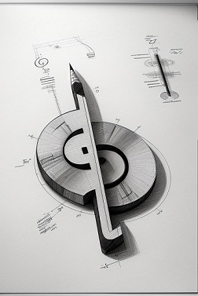

# Build

**Resumo**: Aqui você encontra informações sobre o `build` de `Eutherpe`. Esse
documento é mais voltado para o pessoal do desenvolvimento.

## Tópicos

- [`Como construo o binário Eutherpe?`](#como-construo-o-binário-eutherpe)
- [`Como executo os testes?`](#como-executo-os-testes)
- [`Instalei go no Raspberry Pi mas não consigo rodá-lo`](#instalei-go-no-raspberry-pi-mas-não-consigo-rodá-lo)

### Como construo o binário Eutherpe?

O binário `Eutherpe` se trata de um programa escrito em `Golang`. Nisso, o `build`
dele é extremamente simples e direto. Estando dentro do diretório `src` execute:

```
# go build
```

[`Voltar`](#tópicos)

### Como executo os testes?

Gostei, hein? Está preocupando-se com os testes. Isso é bom! Sinal de desenvolvedores
pragmáticos, perfeccionistas.

Sendo o núcleo de `Eutherpe` uma aplicação `Golang`, os testes são executados chamando
o seguinte comando (estando dentro do diretório `src`):

```
# go test internal/...
```

Se quiser mais informações sobre o que está acontecendo no processo, execute:

```
# go test internal/... -v
```

> [!TIP]
> `Golang` tem um comportamento meio irritante de cachear o resultado dos testes
> se quiser forçar a execução de todos os testes, antes de dispará-los, limpe o
> cache da seguinte forma:
>
> ```
> # go clean -testcache
> ```

[`Voltar`](#tópicos)

### Instalei go no Raspberry Pi mas não consigo rodá-lo

Se você fez o processo de [`bootstrapping`](MANUAL-PT.md#bootstrapping), tente rodar o seguinte comando:

```
# source /etc/profile.d/goenv.sh
```

[`Voltar`](#tópicos)
