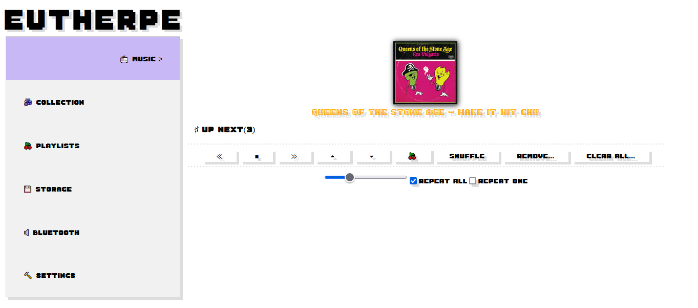

# Eutherpe Manual

**Abstract**: This document gathers all information about `Eutherpe`: my motivations, project
decisions, how to install and using it. Ultimately, here you learn how to ride your musical ether.

# Topics

- [What is it?](#what-is-it)
- [Features](#features)
- [Bootstrapping](#bootstrapping)
    - [Bootstrap who?!](#bootstrap-who)
    - [...wow! an ethereal jukebox has really sprouted into my LAN!](#wow-an-ethereal-jukebox-has-really-sprouted-into-my-lan)
- [Knowing the screens](#knowing-the-screens)
    - [The Music screen](#the-music-screen)
    - [The Collection screen](#the-collection-screen)
    - [The Playlists screen](#the-playlists-screen)
    - [The Storage screen](#the-storage-screen)
    - [The Bluetooth screen](#the-bluetooth-screen)
    - [The Settings screen](#the-settings-screen)
- [A sympathetic slooth](#a-sympathetic-slooth)

## What is it?

`Eutherpe` is a kind of jukebox ethereal wiring. Using `Eutherpe` you will be able to
listen to your `MP3` without needing to log on in a `streaming` service external to your `LAN`.
Here you are who `100%` rules.

The basic idea is about having your tunes recored in a `pendrive`, so you plug this `pendrive`
to the computer is running `Eutherpe`, you connect `Eutherpe` to a `Bluetooth` speaker or headphone
and done. Go listening to your music and period.

You are able to control `Eutherpe` from any `web browser`. Being only necessary to connect to the
computer address that is serving `Eutherpe` in your `LAN`.

[`Back`](#topics)

## Features

When writing `Eutherpe` my main concern was `minimalism`. The idea is let you the maximum
possible far from screens and more imerse in the simple act of listening to your music.
From some years until now (2024), due to some much rush of information, we have forgetting
about what is listening, inclusive music. F_cking `FOMO` I just want to slow down surrounded
by what I already love.

So with `Eutherpe` you do not have ads, suggestions, no interruptions. It is only about you
and your tunes. You have your `MP3` collection, you want to listen to it and done.

The main `Eutherpe` features are:

- Minimalistic `Web` stuff. There is no `pharaonic` frameworks here. `HTML`, `javascript`,
  `Golang` and period. I did not bring and **I do not want to bring** the `Desktop` to your
  `web` browser.
- The connection to the `Web` interface can be password authenticated or not. All of it can
  be easily configured from the `Web` interface itself.
- The connection to the `player` (done via `web browser`) can be `HTTP` or `HTTPS`. All of it
  can be easily configured from the `Web` interface itself.
- You are able to connecto to your `Eutherpe` device without needing to run crazy commands to
  figure out the `IP` address of your ethereal `jukebox`.
- You can give tidiness to your music collection. Even it being untidy. When scanning the
  `pendrive` seeking to music files, `Eutherpe` is capable of reading some `metatags` from your
 `MP3` by listing it automagically tidied up by `Artist/Album`. Albums are listed from the latest
 to the oldies.
- You can create `playlists`.
- The `playlists` are associated with the `pendrive`, if you plug another one, these playlists
  will vanish away, but if you plug the associated `pendrive` back, they will show up back, too.
- Each tune can be tagged up.
- `Tags` are basically keywords: `80s`, `best solos`, `stoner rock`, `mojo`, `blues`, `jazz`,
  `friday night`, `grumpy monday` etc.
- You can ask to `Eutherpe` to play `n` songs that fit up to a list of `tags` given by you.
- The essential dynamics of `Eutherpe`'s player is of a `jukebox`, then you actively select
  what you want to listen to.
- You can connect `Eutherpe` to an output `Bluetooth` sound device (speakears or headphones).
- `Eutherpe` supports `MP3`, `MP4` and `M4A`.
- The last usage session is saved, so your selections stay remain between listening sessions.
  It does mean that you can continue your audition from the point that you previously stopped.
- The `web` interface renders pretty well in `desktop` or `mobile` devices.
- It works based on `Linux`.
- On `Windows` you can use `Eutherpe` from a [`virtual machine`](VM-EN.md).
- You still can use `Eutherpe` embedded in a `raspeberry-pi` and in this case it will be called
  `Euther-PI`.

[`Back`](#topics)

## Bootstrapping

### Bootstrap who?

> [!IMPORTANT]
> If you are not from the crazy flying gang of people that program computers, maybe it will be
> nice to understand what a hell means `bootstrapping`.

Well, it is a term that we use to indicate that we will provide all necessary to start playing.
It would be similar to `free solo` on climbing by fixing all crampons by making easy and safer
future ascendings. It seems that the term is original from a story called *The surprising Adventures
of Baron Munchausen*, written by Rudolf Erich Raspe. In this story the baron was saved himself
and your horse from a swamp by pulling itself and his horse by its pigtail (so true...). Some folks
arguments about other origins of this term, but here it is not the case. The essence of the idea is
that in the `bootstrapping` the goal is to overcome a swampy part, dry in resources to at the end
to arrive in a solid ground. All by using practically nothing or few resources.

In the `Eutherpe`'s case, the `jukebox` uses some dependencies to make all its ecosystem. Those
dependencies are applications and resources that `Eutherpe` uses under the hood to provide
all infrastructure to you nod your head, dance naked at your living room or simply having an
ambient music.

> [!IMPORTANT]
> `Eutherpe` was developed based on `Debian Linux` distribution. So the `bootstrapping`
> **needs to be done from a `Debian` installation (I advise)**.

The indicated is you make a `minimal` installation (without `desktop` resources). Just
a shell based environment. Why? Well, what happens is that when you install so much unecessary
things, the whole system will start be busy by taking care of those white elephants and,
this waste of resources can impact the listening of your beloved tunes.

> [!TIP]
> I indicate `Debian 12` (only `text-based`, with networking, because when `bootstraping` we
> need to download and install some specific packages).

The `Debian 12` was my distro of choice to develop `Eutherpe`. Previously I tried full `12` but
it sucked as hell and I was also using `Gnome` and all those trinkets *- that for `Eutherpe`'s
goal are essentially pointless*.

Now maybe you are thinking: *"- Gosh to do the 'bootstrapping' shall be hard as a rock..."*.
Take it easy, it is not!

[`Back`](#topics)

### ...wow! an ethereal jukebox has really sprouted into my LAN!

After you set up a minimal `Debian` installation, it is necessary you login in the system as `root`.

Once logged as `root`, you need to download `Eutherpe's` source and to be doing it you will need
to `git` application.

In order to install it you need the following command (if you installed `Debian 11` it is necessary
that you insert the `CD-ROM` or its .iso image):

```
# apt install git -y
```

After installing `git` it is time to download `Eutherpe's` source-code, by running the following:

```
# git https://github.com/rafael-santiago/eutherpe -b v1
```

A directory called `eutherpe` will be created, let's access it using the following commnad:

```
# cd eutherpe
```

Done! Now it is only about doing the `bootstrapping` :boot: by running the following command:

```
# ./bootstrapping.sh
```

You need to confirm with `y` or `Y` and all will be done. The dependencies will be installed,
system fine tunes will be done. You will get an output similar to it:

```
#########################
       ,|_|,   ,|_|,
       |===|   |===|
       |   |   |   |
       /  &|   |&  \
  _.-'`  , )* *( ,  `'-._ [ Eutherpe's Bootstrap ]
   `"""""`"`   `"`"""""`
#########################

Hi there! I am the Eutherpe's bootstrap! What I am intending to do: 

- Create an user "eutherpe";
- Add it to sudo's group;
- Install some system dependencies required to you play your beloved tunes;
- Install Golang to actually build Eutherpe's app;
- Install kernel headers to make easy any specific system tune that you may want to do;
- Create the default's USB mount point in /media/USB;
- Build bluez-alsa from scratch and install it;
- Build up Eutherpe's app;
- Install whole Eutherpe's subsystem;
- Finally, reboot your system to finish applying all changes;

Do you want to bootstrap your system? [y/n]
(...)
```
> [!TIP]
> The bootstrap script will ask you if do you want to change the Eutherpe's default listen port,
> The default one is 8080, it is not considered a best practice using the port 80. Anyway, if
> you want to change it to the port you think better, you can!

Once the `bootstrapping` done you will be able to acces your ethereal `jukebox`
by using a nearest `web browser` at [`http://eutherpe.local:8080/eutherpe`](http://eutherpe.local:8080/eutherpe).

*Voilà!* :sunglasses:

> [!TIP]
> If you have changed the default port browse :point_right: `http://eutherpe.local:<chosen-port>/eutherpe`.

Now it is time to know your no-frills-minimalist `juke`!

[`Back`](#topics)

## Knowing the screens

The initial `Eutherpe's` configuration it will be pretty basic:

- `HTTP` connection;
- No password authenticated;
- A straightforward `Jukebox` ready-to-go;

When connecting to `http://eutherpe.local:8080/eutherpe` you will see the screen illustrated by **Figure 1**.


**Figure 1**: The main screen of your ethereal juke.

Notice that it is about a straightforward screen. By having a left-sided menu where you access
the functions and configurations from your ethereal `juke`.

[`Back`](#topics)

### The Music screen

In the **Figure 2** you can see the `player` screen layout. It is pretty self explanatory.
Basically the screen offers the basic functions such as play, stop the music, go to next,
go to prior, move songs up/down in the repoduction list, activate `shuffle`, remove selected
songs from reproduction list and clear all reproduction list.


**Figure 2**: The straightforward `Music` screen.

You still have a `slider` to control the volume and the possibility of activating the repetion
modes (all or one song).

In order to access the reproduction list, you need to click on `UP NEXT`. By the way, it is
time to teach you about a convention that I decided to follow.

> [!TIP]
> If you are really crazy about music, maybe you have already noticed that, if not yet, now
> you will go: all that is preceded by the sharp symbol, means that when you click it, more info
> will be shown. Once it shown, by its side the flat symbol will turn into a flat symbol. Now
> when clickin on this sharp symbol, the information will be hidden. The relationship between
> `sharp/flat` is equals to `+/-`, :wink:!

Take a look at **Figure 3** a reproduction list shown in detailing mode. Noticed each song
have by their side a checkbox that you will check to apply some functions over those songs.
Functions like: remove and move. If you want to play a specific song just select it and
click `play`.


**Figure 3**: Up next list in detailed mode.

Done! Being `Eutherpe` a no-frills `jukebox`, you already know every single thing about how
to pilot its `player`. Nonetheless, you may have be intrigued: **how can I select songs to play?*

[`Back`](#topics)

## The Collection screen

In this screen you have all access to the songs that `Eutherpe` could be able to find out in
your storage device. Undestand it as your shelf, where all your albums follows tidied up.
Notice: tidied up. Tidied, even you being an untidy creature! :wink:

Take a look at the screen's `layout` in **Figure 4**. In this screen I also have been using
that crazy *sharp/flat* convention...


**Figure 4**: The `Collection` screen.

Still related to the screen depicted in **Figure 4**, notice that the collection is sorted
following `Artist/Album/Song` and that the newest ablbums are listed before the old ones.
Artists, albums and songs can be used to compose a selection (because they have check boxes
at their side, I am pretty sure that you figured it out!).

At the bottom side of the screen you will see the following autoexplaining buttons:

- `ADD TO NEXT` (adds your selection to the end of the reproduction queue)
- `ADD TO UP NEXT` (adds your selection just after the current reproduction position)
- `ADD TO PLAYLIST...` (adds the selection to a new or previous existent `playlist`)
- `ADD TAGS...` (tags up the selection using tags provided by you)
- `DEL TAGS...` (removes previous added tags from the selection)
- `PLAY TAGGED...` (play a certain quantity of songs taking into consideration `tags` provided by you)

> [!TIP]
> Here we have another convention. All that is about a button containing ellipsis means that when
> clicked, another screen asking from more info will be presented. At this point, remember
> `The Hitchhiker's Guide to the Galaxy`: `DON'T PANIC`! :wink:

The **Figure 5** depicts the screen presented when you click `ADD TO PLAYLIST...`, you need to
provide the `playlist` name that you want to add to. If you gave up adding anything, just click
`BACK`, `Eutherpe` is easy going.

> [!TIP]
> At the `Music` screen exists a "cherry button" that you can use to add the entire up next
> or some songs from it to a `playlist`. It follows the same dynamics.


**Figure 5**: Do you like creating music lists?

The **Figure 6** shows a screen similar to shown in **Figure 5** but it is used to tag up
a song selection.


**Figure 6**: What about adding tags to your favorite songs?

In **Figure 7** you see a screen dedicated to remove `tags` from a selection. The general idea
is that you uncheck all `tags` that you want to remove and finally confirm it by clicking in
`SAVE`. If you have changed your mind and you do not want to remove tags anymore, click `BACK`,
`Eutherpe` will not fight you.


**Figure 7**: Do you want to remove tags?

The **Figure 8** illustrates what you see when clicking on `PLAY TAGGED...`. You need to provide
a list of `tags` separated by comma, besides indicating the total of songs you want to listen to.
By clicking on `PLAY` you confirm it, by clicking on `BACK` means that you give up playing
random songs that follows some tagging, that's ok, `Eutherpe` will not complain...


**Figure 8**: Once tagged you can play your songs by referencing their tags.

[`Back`](#topics)

## The Playlists screen

The **Figure 9** depicts `Playlists` screen. From this screen you are able to play an entire
`playlist` or some song picked from it. Besides edit playlists, too.


**Figure 9**: Here you select/edit your playlists.

Notice that each `playlist` shown hide their songs. When you click on the name of a `playlist` all
songs will be listed. Take a look at **Figure 10** that shows the playlist named `HOW-LOU`
(yes, I like `Lou Rawls`!) being detailed.

![Detailing a playlist)(figures/eus-pt-br-playlists-listing.png)
**Figure 10**: Playlist "HOW-LOU" being detailed.

The functions offered by this screen are:

- `REMOVE...` (you select a playlist you want to remove).
- `CLEAR...` (you select a playlist you want to clear).
- `SONGS UP` (you will move up all selected songs).
- `SONGS DOWN` (you will move down all selected songs).
- `REMOVE SONGS...` (you select the song(s) you want to remove).
- `REPRODUCE` (you will play the selected `playlist`).
- `REPRODUCE SELECTION` (you will play only the specific songs selected from a playlist).
- `BACKUP...` (you will copy the playlists to the selected storage device).

Done! You have just graduated at the `Eutherpe DJs` school, congrats!

[`Back`](#topics)

## The Storage screen

The `Storage` screen is where you tell to `Eutherpe` the source of your songs.

The **Figure 11** depicts what you will get on this screen. This screen offers five operations:

- `LIST` (all `USB` devices found are listed, if you have just plugged a USB stick, it is necessary
to click on this button to access you new device).
- `SET` (confirms the selected device from the found devices listed).
- `SCAN` (the selected device is scanned and the collection is extracted, organized and shown at
the Collection screen, the first scanning tends to take longer, this is because the way of
`USB` devices work on `Linux`).
- `CONVERT` (all songs encoded as `MP4` or `M4A` will be converted into `MP3`, this is necessary to play those songs).
- `RESTORE PLAYLISTS...` (restores a previous playlists copy from the storage device).


**Figure 11**: The `Storage` screen.

Once the device chosen and scanned, at the next session, if `Eutherpe` detects that the `USB`
device is plugged, your ethereal `juke` is smart enough to show you the last scanning result
since the last time. If you added or removed some songs or even relocated them, you will need
to click on `SCAN` again.

[`Back`](#topics)

## The Bluetooth screen

The **Figure 12** brings the screen `Bluetooth`. In the similar way of other screens, it is
very straightforward. It has three functions triggered by three buttons:

- `PROBE` (you click on it to probe the surroundings trying to find the `Bluetooth` device
that you are looking for).
- `PAIR...` (you click on it to pair with the found device that you selected from the probing
result list, according to the **Figure 13**).
- `UNPAIR..` (you click on it to unpair the previous paired device).


**Figure 12**: The `Bluetooth` screen.


**Figure 13**: Confirming bluetooth pairing attempt.

After pairing with a output device, the `ID` of this device is indicated, take a look at
**Figure 14**.


**Figure 14**: Paired device.

[`Back`](#topics)

## The Settings screen

The `Settings` screen is the place where you can put your `juke` in the way you want. The general
look of this screen can be seen in **Figure 15**.


**Figure 15**: The `Settings` screen.

The screen has plenty of functionalities but all are pretty straightforward on configuring:

- **a.** When checked a screen asking for access password will be presented. The default password is hard to remember: `music`.
- **b.** When checked, the connection to the `Web` interface will be `HTTPS`.
- **c.** Click here and you generate a self-signed certificate to be used with `HTTPS`.
- **d.** Click here and you download the certificate, if you want to install it in the `Eutherpe`'s
client host.
- **e.** Here you open an interface to configure `WLAN`, so `Eutherpe` will be able to ingress
in you `Wi-Fi` by picking an `IP` that you can access via your smartphone, desktop, whatever.
- **f.** You confirm the local name to access the `Web` interface. It is important to follow the
form `<something>.local`, it you just define `<something>` `Eutherpe` you complete it with
`.local` in order to finish up configuring.
- **g.** Click here and you will get information about licensing and versioning.
- **h.** Click here and you shut down the device running `Eutherpe` (this is useful when you are
running `Eutherpe` embedded [actually, this is the basic idea] but you do not want to put
pushdown on/off button on your board).
- **i.** Click here and you restart the device running `Eutherpe`, you know, in computing
sometimes we need to `reboot` to troubleshoot. Although I seek to make `Eutherpe` as stable
as possible to you :wiki:!
- **j.** In this edit you define the used name to access the `Eutherpe`'s `Web Interface`.
- **k.** If you want to change the access passowrd to the `Web` interface, click here.
If you forget the password you will have to do some incantations to reset it. More on over!

[`Back`](#topics)

## A sympathetic slooth

In plenty of operations you will face a sympathetic slooth ask you to wait. Do not be afraid of
and just wait it :sleeping:. Take a look at **Figure 16** :sweat_smile:!


**Figure 16**: Wait bro!

[`Back`](#topics)
