# Manual Eutherpe

**Resumo**: Esse texto reúne todas as informações sobre `Eutherpe`: minhas motivações, decisões
de projeto, como instalar e usar. Enfim, aqui você aprende pilotar o seu éter musical.

## Tópicos

- [O que é?](#o-que-é)
- [Características](#características)
- [Bootstrapping](#bootstrapping)
    - [Ãh?!](#ãhm)
    - [...e não é que jukebox etérea brotou na minha LAN!](#e-não-é-que-uma-jukebox-etérea-brotou-na-minha-lan)
- [Conhecendo as telas](#conhecendo-as-telas)
    - [A tela Music](#a-tela-music)
    - [A tela Collection](#a-tela-collection)
    - [A tela Playlists](#a-tela-playlists)
    - [A tela Storage](#a-tela-storage)
    - [A tela Bluetooth](#a-tela-bluetooth)
    - [A tela Settings](#a-tela-settings)
- [Uma preguiça simpática](#uma-preguiça-simpática)
- [Sobre a escolha individual de músicas nas listas](#sobre-a-escolha-individual-de-músicas-nas-listas)

## O que é?

`Eutherpe` é uma espécie de fiação etérea para `jukebox`. Utilizando `Eutherpe` você será
capaz de ouvir suas `MP3` sem necessidade de se logar em nenhum serviço de `streaming` externo
a sua rede local. Aqui é você quem `100%` manda.

A ideia básica se centra em você ter suas músicas gravadas em um `pendrive`, plugar esse `pendrive`
ao computador rodando `Eutherpe`, conectar `Eutherpe` a uma caixa de som ou `headphone`
`Bluetooth` e feito! Vá escutar sua música e acabou.

Você consegue controlar `Eutherpe` a partir de qualquer `web browser`, bastando se conectar
ao endereço do computador que está servindo `Eutherpe` em sua rede.

[`Voltar`](#tópicos)

## Características

Ao escrever `Eutherpe` minha principal preocupação foi `minimalismo`. A ideia é deixar você
o máximo possível longe de telas e mais imerso na audição da sua música. Foda-se o `FOMO` eu
só quero desacelerar cercado pelo que eu já previamente amo.

Então com `Eutherpe` você não tem propagandas, nem sugestões, nada disso. É só você e suas
músicas. Você tem a sua coleção de `MP3` quer ouvir suas músicas e só.

As principais características de `Eutherpe` são:

- Minimalismo na interface `Web`. Nada de `frameworks` faraônicos e tal. `HTML`, `javascript`,
  `Golang` e acabou. Não trouxe e nem quero trazer o `Desktop` para dentro de seu navegador `Web`.
- Conexão à interface `web` pode ser autenticada por senha ou não. Tudo isso facilmente
  configurável via a própria interface `Web`.
- Conexão ao `player` via `web browser` pode ser `HTTP` ou `HTTPS`. Tudo isso facilmente
  configurável via a própria interface `Web`.
- Você consegue se conectar ao seu dispositivo `Eutherpe` facilmente, sem precisar ficar
  rodando comandos malucos para descobrir o endereço `IP` da sua `jukebox` etérea,
  pois isso nada realmente tem a ver com o que você quer fazer: *ouvir a f_cking p_rra da
  sua música, ora!* :notes:!
- Você consegue dar organização para sua coleção mesmo estando ela armazenada de forma
  desorganizada. Ao escanear o `pendrive` em busca de músicas, `Eutherpe` é capaz de ler
  as `metatags` das suas `MP3` e listá-las automagicamente organizadas por `Artista/Álbum` e
  organizados ainda dos lançamentos mais recentes para os mais antigos.
- Com `Eutherpe` você consegue criar `playlists`.
- As `playlists` ficam associadas ao `pendrive`, se você puser outro no lugar, elas sumirão,
  mas se você voltar a conectar o `pendrive` associado as suas `playlists`, elas reaparecerão.
- Cada música pode ser marcada com `tags`.
- `Tags` são basicamente palavras-chave: `80s`, `solos favoritos`, `stoner rock`, `mojo`,
  `blues`, `jazz`, `soul`, `sextou`, `segundou que tédio` etc.
- Você pode pedir para a `Eutherpe` tocar `n` músicas que se encaixem numa lista de `tags`
  que você passar.
- A dinâmica essencial do `player Eutherpe` é a de uma `jukebox`, então você seleciona
  ativamente o que quer ouvir.
- Você pode se conectar a um dispositivo de saída `Bluetooth` (caixas de som ou `headphones`).
- `Eutherpe` dá suporte para `MP3`, `MP4` e `M4A`.
- A última sessão é salva, então suas seleções ficam gravadas entre um uso e outro do aplicativo.
  Você pode continuar a audição do ponto que parou.
- Interface `Web` renderiza bem tanto no `Desktop` quanto em dispositivos móveis.
- Funciona baseado na plataforma `Linux`.
- No `Windows` você pode utilizar `Eutherpe` a partir de uma [`máquina virtual`](VM-PT.md).
- Você ainda pode usar `Eutherpe` dentro de um `Raspberry Pi` e nesse caso ela será carinhosamente
  chamada de `Euther-PI`.

[`Voltar`](#tópicos)

## Bootstrapping

### Ãhm?!

> [!IMPORTANT]
> Se você não é da gangue voadora dos malucos (leia-se gente que programa computadores), talvez
> seja legal entender o que cargas d'água significa `bootstrapping`.

Bem, isso é um termo que utilizamos para indicar que vamos provisionar todo o necessário para
começar de fato a brincadeira. Seria um escalar sem corda colocando os grampos, para que
posteriores escaladas sejam mais fáceis. Ao que parece esse termo veio de uma história de
*"As supreendentes Aventuras do Barão Munchausen"* (tradução livre), escrito por Rudolf Erich
Raspe. Onde nessa história o barão teria saído de um pântano puxando a si mesmo e seu cavalo pelo
rabo (é vdd esse bilete [sic]...). Há controvérsias mas o sentido se mantém: no `bootstrapping`, o
objetivo é passar por uma parte complicada, pantanosa, árida em recursos para então chegar do outro
lado onde tudo será mais sólido sob os nossos pés e para isso usamos praticamente nada ou parcos
recursos.

No caso do `Eutherpe`, a `jukebox` utiliza algumas dependências para compor todo o seu
ecossistema. Essas dependências no caso são aplicativos e recursos que ele usa por baixo dos
panos para prover toda a infraestrutura necessária para você bater cabeça, dançar pelada(o)
na sala ou simplesmente pôr uma música na conversa.

> [!IMPORTANT]
> `Eutherpe` foi desenvolvido tendo como contrapartida a distribuição `Linux` `Debian`. Então
> o `bootstrapping` **precisa ser feito a partir de uma instalação `Debian` (eu aconselho)**.

O ideal é você fazer uma instalação `Debian` mínima (sem recursos para `desktop`). Apenas
console mesmo. Por que? Bem, o que acontece é que quando você coloca muita coisa desnecessária,
o sistema vai começar perder tempo e recursos tomando conta desses elefantes brancos e, esse
desperdício pode impactar na audição das suas amadas músicas.

> [!TIP]
> Te indico instalar o `Debian 12` (somente console, com a rede configurada, pois o `bootstrapping`
> irá baixar pacotes específicos da Internet para deixar o seu `Debian` no jeito para rodar
> `Eutherpe`).

O `Debian 12` foi o meu sistema de escolha para desenvolver `Eutherpe`, tentei o `12` completo mas
ficou bem ruim e estava utilizando um sistema com `Gnome` e todas aquelas tranqueiras *- que para o
objetivo de `Eutherpe` são essencialmente inúteis*.

Você deve estar pensando: *"- Poxa fazer esse tal 'boostrapping' deve ser difícil bagarai..."*.
Relaxa, não é!

[`Voltar`](#tópicos)

### ...e não é que uma jukebox etérea brotou na minha LAN!

Após você preparar uma versão mínima `Debian` é necessário que você faça login como usuário `root`.

Uma vez a sessão `root` iniciada, você precisa baixar o código-fonte do `Eutherpe` e para isso você
precisará do aplicativo `git`.

Então vamos instalá-lo, emitindo o seguinte comando (se você instalou o `Debian 12` vai precisar
inserir o `CD-ROM` ou imagem `.iso` dele):

```
# apt install git -y
```

Com o `git` instalado é hora de baixar o código-fonte do `Eutherpe`, usando o seguinte comando:

```
# git clone https://github.com/rafael-santiago/eutherpe -b v1
```

Um diretório chamado `eutherpe` será criado, vamos acessá-lo usando o seguinte comando:

```
# cd eutherpe
```

Pronto! Agora é só fazer o `bootstrapping` :boot: emitindo o seguinte comando:

```
# ./bootstrapping.sh
```

Você precisa confirmar com `y` ou `Y` e tudo será feito. As dependências instaladas, ajustes
finos no sistema serão feitos. Você terá uma saída similar a essa:

```

#########################
       ,|_|,   ,|_|,
       |===|   |===|
       |   |   |   |
       /  &|   |&  \
  _.-'`  , )* *( ,  `'-._ [ Eutherpe's Bootstrap ]
   `"""""`"`   `"`"""""`
#########################

Hi there! I am the Eutherpe's bootstrap! What I am intending to do: 

- Create an user "eutherpe";
- Add it to sudo's group;
- Install some system dependencies required to you play your beloved tunes;
- Install Golang to actually build Eutherpe's app;
- Install kernel headers to make easy any specific system tune that you may want to do;
- Create the default's USB mount point in /media/USB;
- Build bluez-alsa from scratch and install it;
- Build up Eutherpe's app;
- Install whole Eutherpe's subsystem;
- Finally, reboot your system to finish applying all changes;

Do you want to bootstrap your system? [y/n]
(...)
```
> [!TIP]
> O script de bootstrap vai te perguntar se você deseja mudar a porta default da Eutherpe.
> A padrão é a 8080, não é uma boa prática usar a porta 80. Mas caso você deseje mudar para
> a porta que bem entender, é possível!

Uma vez o `bootstrapping` feito você poderá acessar sua `jukebox` etérea a partir
de um `web browser` mais próximo via o endereço: [`http://eutherpe.local:8080/eutherpe`](http://eutherpe.local:8080/eutherpe).

*Voilà!* :sunglasses:

> [!TIP]
> Se você mudou a porta default acesse :point_right: `http://eutherpe.local:<porta-escolhida>/eutherpe`.

É hora de conhecer a sua `juke` minimalista e sem frescuras!

[`Voltar`](#tópicos)

## Conhecendo as telas

A configuração inicial da sua `jukebox` `Eutherpe` vai ser bem básica:

- Conexão `HTTP`;
- Sem autenticação por senha;
- `Jukesona` raíz `ready-to-go`;

Ao se conectar em `http://eutherpe.local:8080/eutherpe` você verá a tela ilustrada pela **Figura 1**.

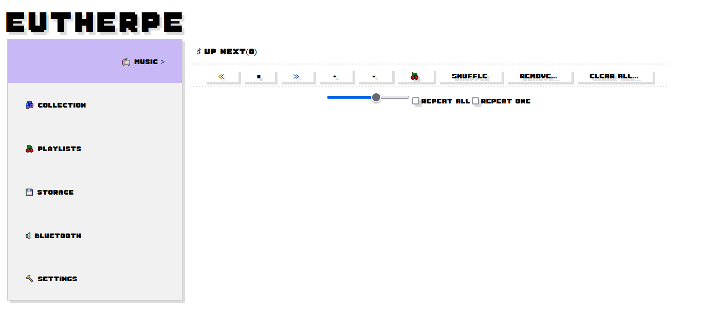
**Figura 1**: A tela principal da sua juke etérea, o player direto ao assunto.

Note que se trata de uma tela bem direta ao assunto, possuindo um menu do lado esquerdo onde
você acessa as funções e configurações da sua `juke` etérea.

[`Voltar`](#tópicos)

### A tela Music

Na **Figura 2** você confere o *layout* da tela do `player`. Ela é bem autoexplicativa. Basicamente
a tela te oferece funções básicas como tocar, parar a música, ir para próxima da lista de
reprodução, ir para a anterior, mover música(s) para cima ou para baixo da lista de reprodução,
ativar o `shuffle` (que vai misturar a sua lista de reprodução), remover músicas selecionadas da
sua lista de reprodução e limpar toda a lista de reprodução.


**Figura 2**: A tela `Music`, simples e direta ao assunto.

Você ainda tem um `slider` para controlar o volume e a possibilidade de ativar os modos de
repetição geral ou repetição de apenas uma música (da que estiver atualmente em reprodução).

Para acessar a lista de reprodução, você precisa clicar sobre `UP NEXT`. Vou aproveitar e já
te ensinar sobre uma convenção que adotei.

> [!TIP]
> Se você é realmente um ser musicófilo, já deve ter notado, caso não, agora vai notar:
> tudo que estiver precedido pelo símbolo de *sustenido*, significa que se você clicar sobre
> lhe será exibido mais. Uma vez esse conteúdo exibido, do lado dele o sustenido se tornará um
> *bemol*, o que indica que se você clicar novamente, o conteúdo será ocultado. A relação aqui
> entre `sustenido/bemol` é idêntico a entre `+/-`, :wink:!

Confira na **Figura 3** uma lista de reprodução em modo de detalhamento. Note que do lado de
cada música existe uma caixa de checagem que você poderá marcar para aplicar sobre ela certas
funções como remover e também movê-la para cima ou para baixo da lista de reprodução. Caso
queira tocar uma música específica, selecione ela e dê um `play`.

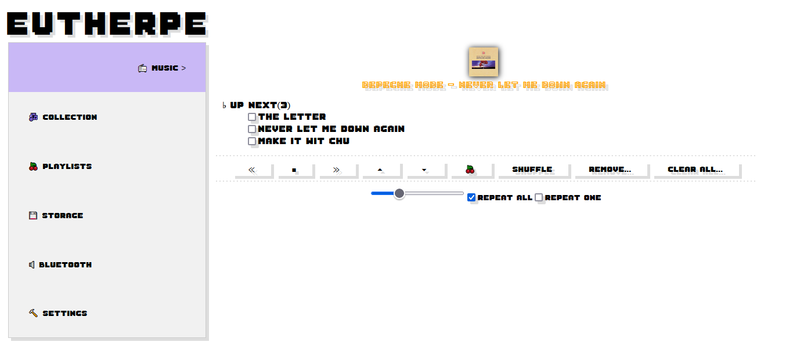
**Figura 3**: Lista de repodução em modo de detalhamento.

Pronto! Sendo `Eutherpe` uma `jukebox` sem frescura, você já sabe tudo sobre como pilotar o
seu `player`. Entretanto, você deve ter ficado com uma pulga atrás da orelha: *como eu seleciono
o que quero tocar?*

[`Voltar`](#tópicos)

## A tela Collection

Nessa tela você tem todo acesso às músicas que `Eutherpe` conseguiu escanear de seu dispositivo
de armazenamento. Entenda essa tela como a sua *estante*, onde todos seus álbuns seguem organizados.
Note: organizados. E isso mesmo se você for uma criatura desorganizada! :wink:

Dá uma conferida na **Figura 4** no `layout` dessa tela. Note que aqui eu também lancei mão daquela
convenção pirada *sustenido/bemol*...

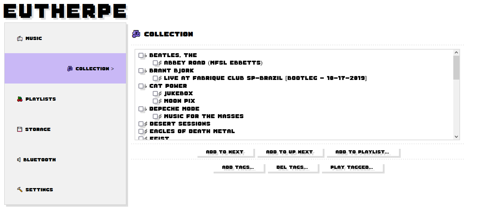
**Figure 4**: A tela `Collection`, onde sua bagunça ganha uma organização :satisfied:!

Ainda em relação à tela ilustrada na **Figura 4**, perceba que a coleção fica organizada seguindo
`Artista/Álbum/Músicas` e os álbuns mais recentes vão sendo listados antes. Artistas, álbums e
músicas podem ser usados para compor uma seleção (pois eles possuem caixas de checagem ao lado
dos nomes, eu tenho certeza absoluta que você entendeu!).

Na parte inferior da tela você vai notar que existem botões bem autoexplicativos:

- `ADD TO NEXT` (adiciona a sua seleção ao final da fila de reprodução)
- `ADD TO UP NEXT` (fura a fila de reprodução e adiciona sua seleção atrás da posição atual de reprodução)
- `ADD TO PLAYLIST...` (adiciona a sua seleção a uma nova `playlist` ou a uma prévia)
- `ADD TAGS...` (marca sua seleção com `tags` fornecidas por você)
- `DEL TAGS...` (remove tags previamente adicionadas da seleção)
- `PLAY TAGGED...` (toca uma quantidade de músicas levando em conta `tags` fornecidas por você)

> [!TIP]
> Aqui temos uma outra convenção. Tudo que for botão com reticências significa que ao clicar,
> uma tela te pedindo mais info vai ser apresentada, nesse ponto lembre do `Guia do mochileiro
> das galáxias`: `DON'T PANIC`! :wink:

A **Figura 5** exibe a tela que é apresentada ao clicar em `ADD TO PLAYLIST...`, você precisa
fornecer o nome da `playlist` a qual deseja adicionar a seleção e clicar em `ADD`. Se quiser
desistir da ideia, apenas clique em `BACK` que está tudo certo `Eutherpe` não brigará com você...

> [!TIP]
> Na tela `Music` existe um botão com uma cereja e lá você usa para adicionar toda a lista de
> reprodução ou músicas presentes nela a uma `playlist`. A dinâmica é a mesma.

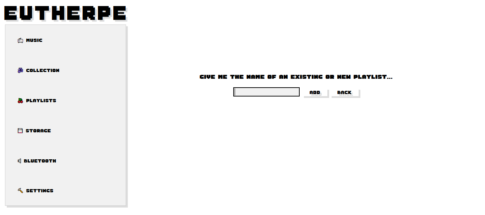
**Figura 5**: Gosta de criar listas de músicas?

A **Figura 6** exibe uma tela similar a da **Figura 5**, porém aqui é para taguear a seleção.

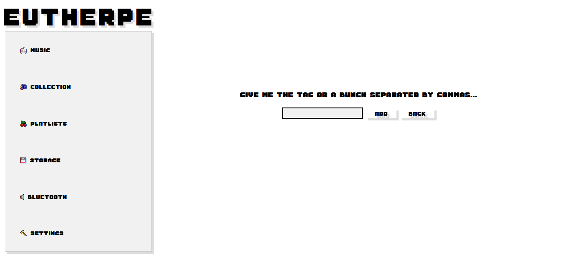
**Figura 6**: Que tal adicionar tags a suas músicas favoritas?

Na **Figura 7** você confere a tela para remover `tags` previamente adicionadas à seleção. A ideia
geral é que você desmarque as `tags` que deseja remover e clique em `SAVE`. Se mudou de ideia e
não quiser remover nada, clica em `BACK`, `Eutherpe` é compreensiva...


**Figura 7**: Decidiu remover uma tag?

A **Figura 8** ilustra o que você encontra ao clicar em `PLAY TAGGED...`. Você precisa fornecer
uma lista de `tags` separada por vírgula e ainda indicar o total de músicas que deseja escutar.
Para confirmar você clica em `PLAY` ou se desistiu e não quer mais clica em `BACK`, `Eutherpe`
vai entender e não reclamar...

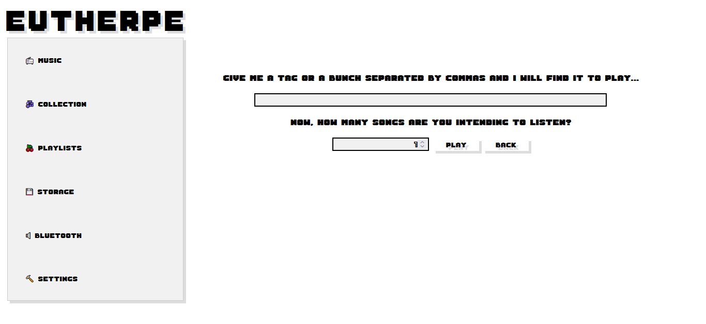
**Figura 8**: Uma vez tagueadas as músicas podem ser tocadas via suas tags.

[`Voltar`](#tópicos)

## A tela Playlists

A **Figura 9** traz a tela `Playlists`. A partir dessa tela você poderá pôr uma `playlist` ou
apenas algumas músicas dela para tocar, além de editá-la.

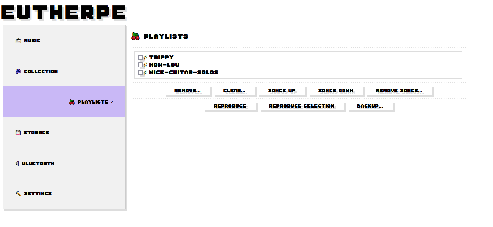
**Figure 9**: Aqui você pode selecionar suas listas para reprodução/edição.

Note que cada `playlist` listada esconde suas músicas e que quando você clica sobre o nome dela
as músicas são listadas, confira a **Figura 10** onde a lista `HOW-LOU` (sim, eu curto
`Lou Rawls`!) está sendo detalhada.


**Figure 10**: Playlist "HOW-LOU" sendo detalhada.

As funções oferecidas por essa tela são:

- `REMOVE...` (você seleciona a playlist que deseja remover).
- `CLEAR...` (você seleciona a playlist que deseja limpar).
- `SONGS UP` (você moverá um ponto para cima dentro da listagem as músicas selecionadas).
- `SONGS DOWN` (você moverá um ponto para baixo dentro da listagem as músicas selecionadas).
- `REMOVE SONGS...` (você seleciona a(s) música(s) que deseja remover).
- `REPRODUCE` (você colocará para tocar a `playlist` selecionada).
- `REPRODUCE SELECTION` (você colocará para tocar as músicas específicas que escolheu a partir da
   listagem geral de uma `playlist`).
- `BACKUP...` (você copiará as playlists para o dispositivo de armazenamento selecionado).

Pronto! Você já se formou na escola de `DJs Eutherpe`, congrats!

[`Voltar`](#tópicos)

## A tela Storage

A tela `Storage` é onde você sinaliza à `Eutherpe` a partir de onde tentar ler suas músicas.
A **Figura 11** ilustra o que você encontra nessa tela. A tela oferece cinco operações:

- `LIST` (todos os dispositivos `USB` encontrados são listados, se você plugou um USB é necessário
clicar nesse botão para ter acesso ao seu novo dispositivo).
- `SET` (o dispositivo selecionado na lista de dispositvos encontrados é de fato selecionado para
uso).
- `SCAN` (o dispositivo é escaneado e a coleção extraída e organizada é listada na tela
`Collection`, no primeiro escaneamento o processo pode demorar um pouco mais, isso é por conta de
como os dispositivos de armazenamento `USB` funcionam no `Linux`).
- `CONVERT` (todas as músicas em `MP4` ou `M4A` serão convertidas para `MP3`, isso é necessário para tocá-las).
- `RESTORE PLAYLISTS...` (restaura uma cópia prévia das playlists a partir do dispositivo de armazenamento).


**Figure 11**: A tela `Storage`.

Uma vez o dispositivo escolhido e escaneado, na próxima sessão, caso `Eutherpe` detecte que o
dispositivo `USB` já esteja plugado, a sua `juke` etérea é esperta o suficiente para já te
apresentar a coleção escaneada da última vez. Se você adicionou ou removeu mais músicas ou
alterou a localização delas, vai precisar clicar em `SCAN` de novo.

[`Voltar`](#tópicos)

## A tela Bluetooth

A **Figura 12** traz a tela `Bluetooth`. Na linha das outras telas é bem direta ao assunto.
Possui três funções disparadas por três botões:

- `PROBE` (você clica nele para sondar o local e ver se encontra o dispositivo `bluetooth` de saída
de áudio do seu interesse).
- `PAIR...` (você clica nele para parear com o dispositivo que você selecionou da lista que a
sondagem te retornou, vai te exibir a tela da **Figura 13**).
- `UNPAIR..` (você clica nele para desparear o pareamento prévio, o som vai parar de emanar via o
dispositivo `bluetooth` que você havia pareado antes).

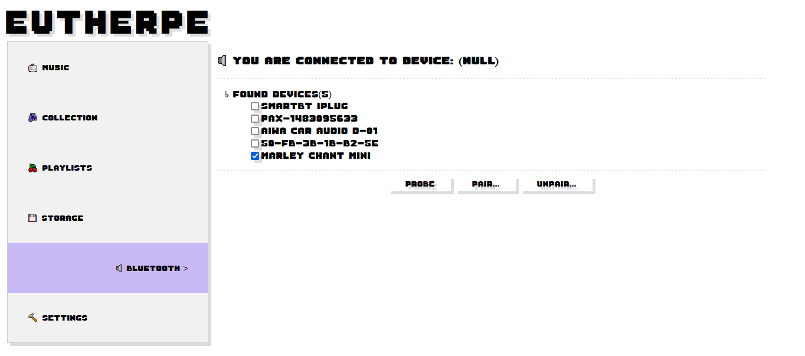
**Figura 12**: A tela `Bluetooth`.

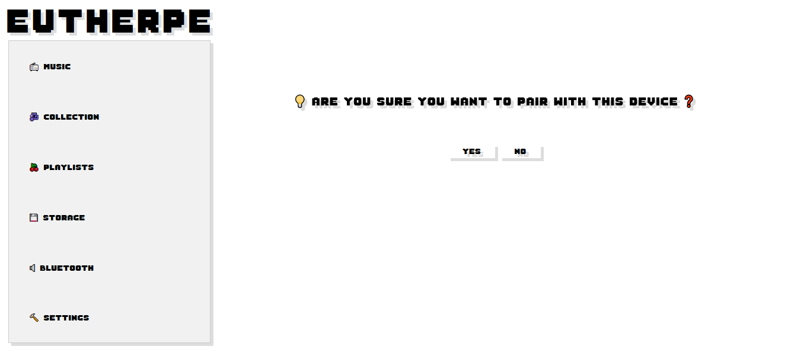
**Figura 13**: Confirmando pareamento.

Após parear com um dispositivo de saída, o `ID` desse dispositivo é indicado, dê uma olhada
na **Figura 14**.

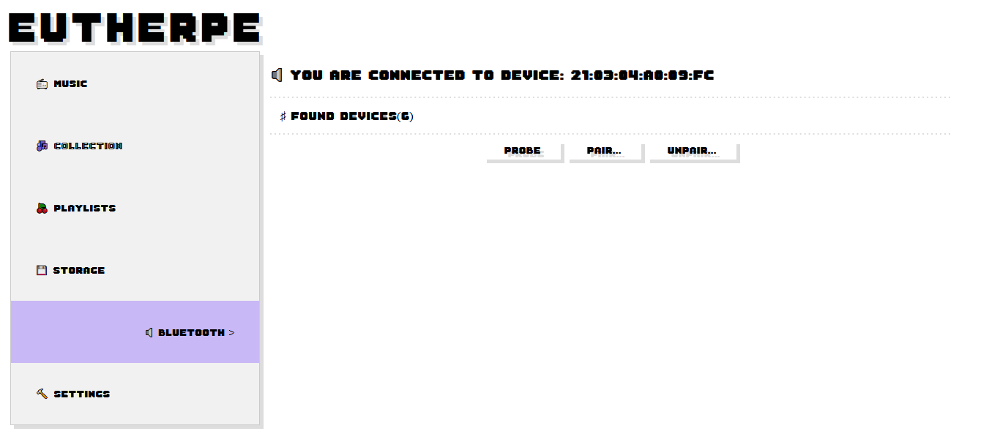
**Figura 14**: Dispositivo pareado.

[`Voltar`](#tópicos)

## A tela Settings

A tela `Settings` é onde você pode deixar a sua `juke` no jeito que mais lhe aprouver (Uau hein?
Sound portuguese babe, I love my mother tongue). A cara geral dessa tela pode ser conferida via
**Figura 15**.

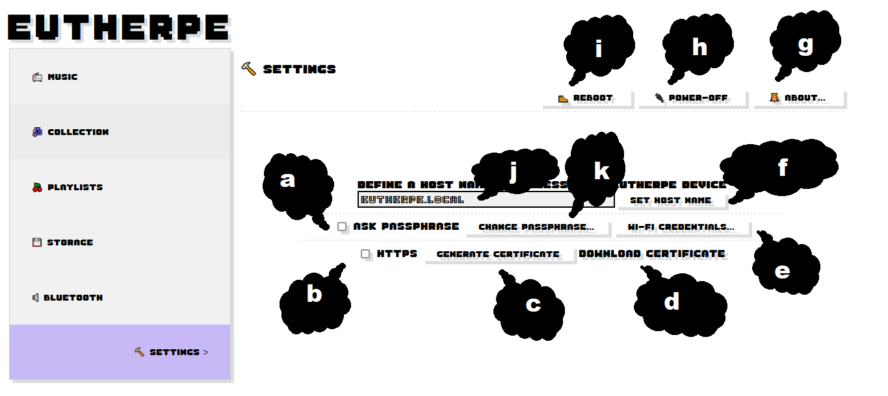
**Figura 15**: A tela `Settings`.

A tela possui várias funcionalidades mas todas são bem diretas de configurar:

- **a.** Quando marcado uma tela pedindo senha de acesso será apresentada. A senha `default` é `music` (essa eu tenho certeza que você nem eu esqueceremos!!!).
- **b.** Quando marcado, a conexão da interface `Web` será via `HTTPS`.
- **c.** Clique aqui e você gera um certificado autoassinado para ser utilizado com o `HTTPS`.
- **d.** Clique aqui e você faz o download do certificado, caso queira instalá-lo no dispositivo que
acessará a interface `Web`.
- **e.** Aqui você abre a interface para configurar a conexão `Wi-Fi/WLAN` para `Eutherpe` ingressar
no seu `Wi-Fi` e você poder controlar o `player` via `cel`, `tablet` ou mesmo `desktop`. Se a rede
da sua casa for sem-fio (quase certo que é), você precisa indicar o nome da sua rede (`SSID`) e a
senha. Relaxa, a senha ficará guardada encriptada, do jeito que deve ser :wink: Eu sou o chato
militante/ilitante da criptografia (e com orgulho!) :smile:
- **f.** Você confirma o nome para acessar a interface `Web Eutherpe`. É importante que seja nos moldes
`<algo>.local`, se você digitar apenas `<algo>` `Eutherpe` vai completar isso com `.local` para
terminar de configurar.
- **g.** Clique aqui e você terá informações sobre versão e licença.
- **h.** Clique aqui e você desliga o dispositivo que está rodando `Eutherpe` (isso é bom para quando
você estiver rodando `Eutherpe` embarcada [na verdade essa é a ideia base] e não quiser colocar
um botão liga/desliga na sua placa).
- **i.** Clique aqui e você reinicia o dispositivo que está rodando `Eutherpe`, você sabe, em computação
sempre tem momentos em que acabamos precisando de um `reboot`. Embora procure deixar `Eutherpe`
mais estável possível para você :wink:!
- **j.** Nessa caixa de texto você define o nome para acessar a interface `Web Eutherpe`.
- **k.** Se você quiser alterar a senha de acesso à interface `Web`, clica aqui. Se esquecer a
senha vai ter que fazer umas madracarias para resetar. Mais para frente te mostro!

[`Voltar`](#tópicos)

## Uma preguiça simpática

Em diversas operações você se deparará com uma simpática preguiça te pedindo para esperar. Não
se assuste e apenas espere-a :sleeping:. Dê uma olhada na **Figura 16** :sweat_smile:!

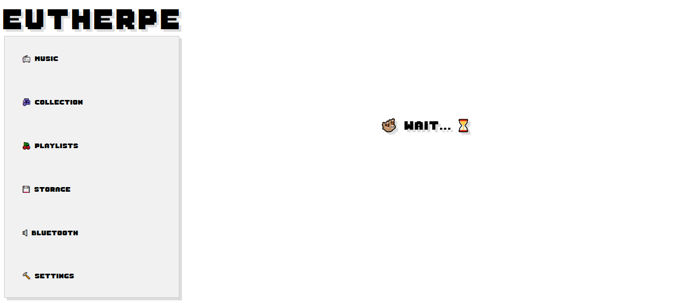
**Figura 16**: Espera aí cara...

[`Voltar`](#tópicos)

## Sobre a escolha individual de músicas nas listas

> [!TIP]
> Nas telas `Music`, `Collection` e `Playlist`, embora as músicas estejam listadas
> de forma sequencial, a ordem de seleção individual de músicas é mantida. `Eutherpe`
> guarda a ordem que você foi selecionando para então adicionar à lista de reprodução
> ou a uma `playlist`. Isso te dá liberdade para selecionar as músicas que quer ouvir
> na ordem que bem entender. Aqui utilidade realmente rima com liberdade!

[`Voltar`](#tópicos)
