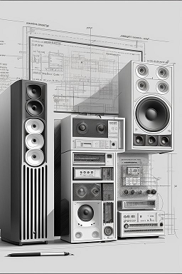

# TODO

Things that I am still plaining for the next versions.

- [ ] Show music lyrics when clicking on the name of the music being reproduced.
- [ ] Give native support for `Windows`.
- [ ] Dark mode.
- [ ] Provide some `EQ`.
- [ ] Add some filtering convenience to quick find a collection entry.
- [x] Show enlarged album cover on a floating transparent div when user click on it.

---
