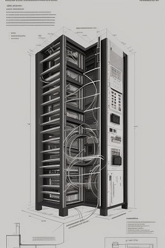

# Solução de problemas

**Resumo**: Adivinha? Aqui você encontra tópicos relacionados a solução de problemas.

## Tópicos

- [Habilitei o login por senha mas esqueci a senha!](#habilitei-o-login-por-senha-mas-esqueci-a-senha)
- [Troquei a senha do Wi-Fi e agora não consigo acessar Eutherpe via web](#troquei-a-senha-do-wi-fi-e-agora-não-consigo-acessar-eutherpe-via-web)

### Habilitei o login por senha mas esqueci a senha!

Para resolver esse problema você vai precisar se logar no computardor que está rodando `Eutherpe`
como usuário `root`.

Se você está logada(o) nessa máquina como um usuário normal, você pode se tornar `root` de diversas
formas:

```
$ sudo su
```

ou:

```
$ sudo -i
```

ou ainda se você não se logou ainda como nenhum usuário, faça o login como `root`.

Uma vez com um prompt `root` edite o arquivo `/etc/eutherpe/player.cache`, faça o que segue:

- Localize no arquivo a configuração `"Authenticated":true` e mude-a para `"Authenticated":false`.
  Você também pode executar o seguinte encantamento: `sed -i 's/"Authenticated":true/"Authenticated":false/g' /etc/eutherpe/player.cache`.
- Ainda no arquivo localize a configuração `"HashKey":"<um montão de letra>"` e substitua para
`"HashKey":""`. Você pode ainda executar esse encantamento aqui: `sed -i 's/"HashKey":".*"/"HashKey":""/g' /etc/eutherpe/player.cache`.
- Salve as alterações que você fez ao `/etc/eutherpe/player.cache`, já com o encantamento do `sed` nem precisa!
- No `prompt` `root` execute `systemctl restart eutherpe`.
- Faça `log-off` do usuário `root` (digite `exit` no `prompt` `root`).
- Agora acesse `Eutherpe` via seu `web browser`, não irá mais pedir senha.
- Caso queira reativar a autenticação e/ou resetar a senha, a senha corrente passou ser `music`.

[`Voltar`](#tópicos)

### Troquei a senha do Wi-Fi e agora não consigo acessar Eutherpe via web

Você precisa se logar como `root` no computador que está servindo `Eutherpe`.

Se você está logada(o) nessa máquina como um usuário normal, você pode se tornar `root` de diversas
formas:

```
$ sudo su
```

ou:

```
$ sudo -i
```

ou ainda se você não se logou ainda como nenhum usuário, faça o login como `root`.

Após feito o `login` `root` edite o arquivo `/etc/eutherpe/player.cache` e faça o seguinte:

- Localize a configuração `"ESSID":"<nome da sua rede Wi-Fi>"` e substitua para `"ESSID":""`.
  Você pode executar esse encantamento aqui também: `sed -i 's/"ESSID":".*"/"ESSID":""/g' /etc/eutherpe/player.cache`.
- Salve a alteração que você fez em `/etc/eutherpe/player.cache`.
  Se você fez o encantamento do `sed`, não precisa!
- No `prompt` `root` execute `systemctl restart eutherpe`.
- Acesse `http://<endereço ip da máquina>:8080/eutherpe`. Se você alterou `Eutherpe`
para usar `https`, use `https://<endereço ip da máquina>:8080/eutherpe`. Se você alterou
a porta substitua `:8080` por `:<porta que você escolheu>`.
- Uma vez que você acessou `Eutherpe` via `web` pode atualizar as infos de senha da Wi-Fi,
reativando-a. Depois com todas as infos atualizadas, faça um reboot e tudo deve voltar ao normal.

[`Voltar`](#tópicos)
