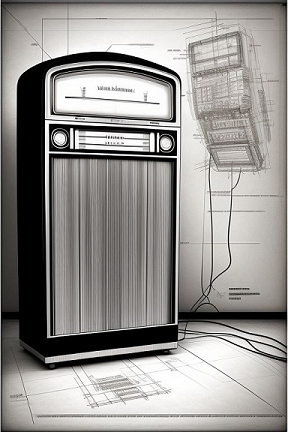

# Running Eutherpe from a virtual machine

**Abstract**: This text is intended to show the main steps of how to configure `Eutherpe`
to be executed from a virtual machine. Here we take into consideration that the reader
has known already all main aspects of application by reading the [manual](MANUAL-EN.md).

## Topics

- [To whom is intended this text](#to-whom-is-intended-this-text)
- [Paraphrasing Dee-Dee Ramone: 1-2-3-4!](#paraphrasing-dee-dee-ramone-1-2-3-4)
- [The general idea of what we are going to do](#the-general-idea-of-what-we-are-going-to-do)
- [Creating the virtual machine from OVA](#creating-the-virtual-machine-from-ova)

### To whom is intended this text

I made my mind write this text thinking in users that do not have a computer running `Linux` natively,
but even so they are wanting to run `Eutherpe`. In general `Windows` users can take advantage
of this document, because until now `Eutherpe` is not `Windows` compatible. I believe that `OSX`
users, too.

> [!NOTE]
> If you already know about virtual machines, you already use them, it is pretty sure that this
> text will not provide anything new. The general idea is creating a virtual machine based on
> `Debian Linux` and then running the `Eutherpe bootstrapping`. If you already know how to do it
> on your own, this text is not for you. :wink:

[`Back`](#topics)

### Paraphrasing Dee-Dee Ramone: 1-2-3-4!

In order to create our `Eutherpe` `VM` (**V**irtual **M**achine) we will use the [`Vitualbox`](https://www.virtualbox.org/Downloads)
application.

You will need to install `Virtualbox` in your system and once it done, we will create a virtual
machine based on an `OVA` that I previously prepared, available at [here](https://drive.google.com/file/d/1J4wEpDknFffUe9LL7VZUTi-rGYR5emm7/view?usp=sharing).

Done! If you have installed `Virtualbox` and downloaded the `OVA` you have already everyhing you
need to continue.

> [!TIP]
> **Remark and tip**: I am not going to give you details about the virtualization concept norb
> virtual machines. Anyway, this is a very neat subject that you could find out a bunch of ideas
> and utilities to solve your day to day needs, I would suggest you to take `Eutherpe` as an excuse
> to go deeper in this subject. :dart:

[`Back`](#topics)

### The general idea of what we are going to do

Bear in mind `OVA` as a `zip` file or an installation program. This file gathers all files that
compounds the virtual machine. Imagine the computer wrapped into a box and then you only have
to get it out of the box, plug in some cables, power it on and done!

The `OVA Eutherpe` is a vitual machine based on `Debian 12` where I installed all basic dependencies
to have an operating system where I could be able to run `Eutherpe`. Yes, after installing this
well basic `Debian 12` I downloaded the `Eutherpe` sources and executed the `bootstrap` (if you have
not read the manual yet, [read it](MANUAL-EN.md) and *voilà*, I powered off the virtual machine
and then I created the `OVA`.

Taking this `OVA`, you will import it from your `Virualbox` and you will have the exact virtual
machine that I made, being needed to apply minor tunings to allow you access the `Eutherpe's
miniplayer` from your `web browser`. After that you will be able to nod your head or dance naked, 
or both :notes: :headphones: :guitar: :microphone: :dancer: :notes:

[`Back`](#topics)

### The general idea of what we are going to do

Take into consideration an `OVA` as a `zip` file or still an install program. This file contains
all files that compound the virtual machine. It is someting like you getting a computer out of
the box and plugging all cables and done!

In the case of `Eutherpe OVA` I created a virtual machine based on `Debian 12` where I took the
care of only installing the basic applications needed to essentially execute `Eutherpe`. Yes, once
finished up the minimal `Debian 12` installation I downloaded the `Eutherpe` sources and then I
ran the `bootstrap` (if you have not read the manual yet, [read it](MANUAL-EN.md) and *voilà*,
I powered off the virtual machine and finally I created the `OVA`.

By using this `OVA` file you will importing it from your `Virtualbox` at the end up of the
importation process you will gave the exact virtual machine that I prepared. You need to apply
a minor adjustment to access the `Eutherpe's miniplayer` from your `web browser`. With it you
will be able to head banging, naked dacing, or even the two! :notes: :headphones: :guitar: :microphone: :dancer: :notes:

[`Back`](#topics)

### Creating the virtual machine from OVA

There is no mistery. Lauch your `Virtualbox` and go to the menu `File|Import Appliance...`. Take
a look at the **Figure 1** to get the clues.

**Figure 1**: Importing the `OVA`.

Just after clicking `Import Appliance...` you will see the screen illustrated by **Figure 2**.
Click button at the right side of the edit `File` and select the `.ova` file that you have
downloaded. Once it selected click `Next` button.

**Figura 2**: Selecting the downloaded `.ova` file.

Finally, it will be presented to you the a screen where you shoykd confirm the importation.
At this screen you have to choose the save location of the virtual machine files, the virtual
machine name. You can let the default values. Once it done click `Finish`. Take a look at
the **Figure 3**.

**Figure 3**: Defining/confirming the final informations before importing the `OVA`.

Now you need to have patience because it can take a while. A progress screen according to the
**Figure 4** it will be presented.

**Figure 4**: :snail: Hold on...

After that your virtual machine it will sprout at the left side of your screen, something
similar to the **Figure 5**.

**Figure 5**: `Eutherpe VM` imported.

Now it will be needed to do a minor adjustment on the network interface of the `VM` before
powering it on. In order to do that select the `VM` at the left side of your screen by clicking
it once, go to menu `Machine|Settings...`. Check on the **Figure 6**.

**Figure 6**: Accessing the `VM` configurations.

It will open a window present in **Figure 7**. Go to `Network` and check on if the configurations
of the network interface are okay. To be okay it is need to:

- The option `Enable Network Adapter` be checked.
- The configuration `Attached to` must be `Bridged Adapter`.
- `Name` need to be the name of the network interface that your real machine uses to access
  the network. In the case of the example, the computer accesses a `Wi-Fi` network, thus the
  `Wireless` interface it was selected. If your conection is cable based, you need to pick up
  the `Ethernet` interface. Well, the possible network interfaces are listed in there, adjust
  it to your state of things.

With the configurations done, if you have changed something (probably yes), click `OK`.

**Figure 7**: Verifying `VM` network configurations.

Done! Now you only need to power the `VM` on and after mapping the `Bluetooth` and `USB Pen-drive`
interfaces. In order to power the `VM` on, select it and go to the menu `Machine|Start|Normal Start`.
Check on the **Figure 8**. It will take a little and so you will se a screen like the
one illustrated in **Figure 9**.

**Figure 8**: Starting the `Eutherpe VM` out.

**Figure 9**: The `Eutherpe VM` is started.

Once the `VM` started it is necessary to configure the `VM` to access your `Bluetooth` and `USB`
controllers. Plug the `USB` containing your songs in your real machine. Go to the menu `Devices|USB`.
It will be shown all devices found by `Virtualbox`. In the example case, the `Bluetooth` interface
is `Intel Corp [0002]` and the `USB Pen-drive` is `SanDisk Cruzer Blade [0100]`. Take a look at
**Figure 10**.

**Figure 10**: The found `USB` devices that can be mapped to `Eutherpe VM`.

So, I clicked both and I waited the `Virtualbox` do its incantations by finally showing them
selected out, according the **Figure 11**.

**Figure 11**: `Bluetooth` and `USB Pen-drive` mapped to `VM Euthrepe`.

Once it done, all is ready! Access the `miniplayer Eutherpe` via [`http://eutherpe.local:8080/eutherpe`](http://eutherpe.local:8080/eutherpe) by using
your `web browser` and operating it according to the way described in [manual](MANUAL-EN.md).
Take a look at the **Figure 12**.

**Figure 12**: :sunglasses:!

> [!IMPORTANT]
> **Remarks**:
>
> - Always after powering the `VM` on it is necessary to map the `Bluetooth` and `USB Pen-drive`.
> While it is not done you will not be able to access the `miniplayer` via `Web`.
>
> - If for some reason you need to log in this `VM` as `root` the password is `music`.

Have fun! :wink:

[`Back`](#topics)
