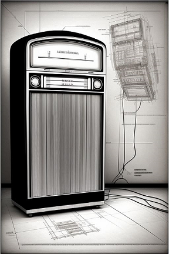
# Rodando Eutherpe a partir de uma máquina virtual

**Resumo**: Esse texto tem a intenção de mostrar os principais passos de como configurar `Eutherpe`
para rodá-la a partir de uma máquina virtual. Aqui partimos do princípio que o leitor já se
inteirou sobre os principais aspectos do aplicativo por meio do [manual](MANUAL-PT.md).

## Tópicos

- [A quem se destina esse texto?](#a-quem-se-destina-esse-texto)
- [Parafraseando Dee-Dee Ramone: 1-2-3-4!](#parafraseando-dee-dee-ramone-1-2-3-4)
- [A ideia geral do que faremos](#a-ideia-geral-do-que-faremos)
- [Criando a máquina virtual a partir da OVA](#criando-a-máquina-virtual-a-partir-da-ova)

### A quem se destina esse texto?

Eu resolvi escrever esse texto pensando em usuários que não dispõem de um computador rodando `Linux`
nativamente e mesmo assim desejam rodar `Eutherpe`. Em geral usuários `Windows` podem se valer
dele, pois até o momento `Eutherpe` não é compatível com `Windows`. Penso que usuários `OSX`
também.

> [!NOTE]
> Se você já sabe sobre máquinas virtuais, já as usa, muito certo que esse texto não irá te
> acrescentar nada. A ideia geral é criar uma máquina virtual baseada em `Debian Linux` e rodar o
> `bootstrapping Eutherpe`. Se você já sabe fazer isso por conta própria, esse texto não é para
> você. :wink:

[`Voltar`](#tópicos)

### Parafraseando Dee-Dee Ramone: 1-2-3-4!

Para criar a nossa `VM` (**V**irtual **M**achine) `Eutherpe` vamos utilizar o aplicativo
[`Virtualbox`](https://www.virtualbox.org/wiki/Downloads).

Você vai precisar instalar o `Virtualbox` no seu computador e após feito isso, iremos
criar uma máquina virtual baseada numa `OVA` que eu previamente preparei, disponível
[aqui](https://drive.google.com/file/d/1yZl8eySD1GwBcFvOAwq1NEDxJ1fR6ol6/view?usp=sharing).

Pronto! Se você instalou o `Virtualbox` e baixou a `OVA` já tem tudo para ir adiante.

> [!TIP]
> **Dica e observação**: Não vou me aprofundar no conceito de virtualização e máquinas virtuais.
> Porém, é algo bem bacana e que com certeza você pode encontrar muitas ideias e utilidades para
> resolver suas necessidades do dia a dia, eu te sugeriria utilizar o ensejo da `Eutherpe` e dar
> uma aprofundada no assunto. :dart:

[`Voltar`](#tópicos)

### A ideia geral do que faremos

Entenda uma `OVA` como um arquivo `zip` ou um programa de instalação. Esse arquivo contém todos
os arquivos que compõem a máquina virtual. É como se um computador estivesse embrulhado dentro de
uma caixa e você apenas precisasse tirá-lo da caixa, conectar uns cabos, ligá-lo à tomada e
pronto!

No caso da `OVA Eutherpe` o que eu fiz foi criar uma máquina virtual baseada em `Debian 12` onde
cuidei de instalar apenas os aplicativos mais básicos para subir um sistema operacional no
qual pudesse ser possível executar `Eutherpe`. Sim, depois que acabei a instalação mínima do
`Debian 12` eu baixei os fontes da `Eutherpe` e rodei o `bootstrap` (se você não leu o manual
ainda, [leia-o](MANUAL-PT.md) e *voilà*, desliguei a máquina virtual e criei a `OVA` (até rimou).

Com essa `OVA`, o que você fará (rimou de novo...) vai ser importá-la a partir do seu
`Virtualbox` e você terá exatamente a máquina que preparei, precisando apenas fazer um pequeno
ajuste para que então você possa acessar o `miniplayer Eutherpe` a partir do seu `web browser`
e então começar bater cabeça ou dançar peladão na sala, ou ainda, os dois! :notes: :headphones: :guitar: :microphone: :dancer: :notes:

[`Voltar`](#tópicos)

### Criando a máquina virtual a partir da OVA

Não tem mistério. Abra o seu `Virtualbox` e vá no menu `Arquivo|Importar Appliance...`. Dê
uma olhada na **Figura 1** para você se situar melhor.

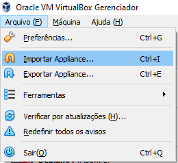

**Figura 1**: Importando a `OVA`.

Ao clicar em `Importar Appliance...` lhe será apresentada a tela ilustrada pela **Figura 2**.
Clique no botão ao lado direito da caixa de texto `Arquivo` e escolha o arquivo `.ova` que
você fez `download`. Uma vez que você escolheu o arquivo clique em `Próximo`.

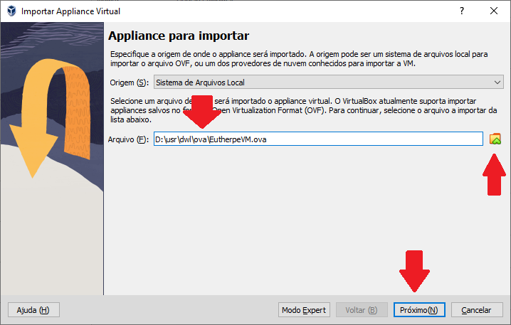

**Figura 2**: Selecionando o arquivo `.ova` que você baixou.

Por fim, lhe será apresentada uma tela para confirmar a importação, nessa tela você pode escolher
o caminho onde serão salvos os arquivos da máquina, o nome da máquina. Você também pode deixar
os valores sugeridos. Para finalmente ter a sua `VM Eutherpe` clique em `Finalizar`. Veja a
**Figura 3**.

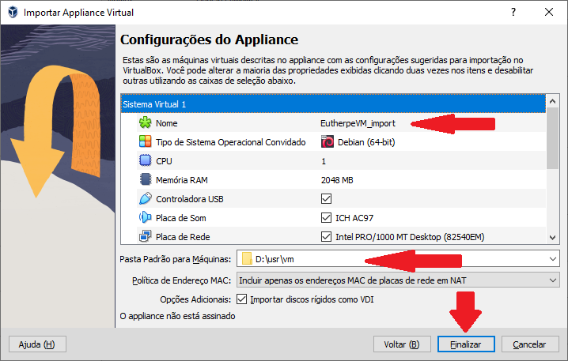

**Figura 3**: Definindo/confirmando as últimas informações antes da importação.

Agora você precisa ter um pouco de paciência pois pode demorar um pouco. Uma tela com progresso
conforme a **Figura 4** vai ser apresentada.

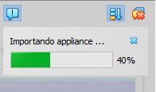

**Figura 4**: :snail: Aguenta aí...

Depois disso a sua máquina vai brotar no canto esquerdo da sua tela, algo similar à **Figura 5**.

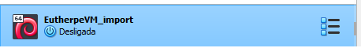

**Figura 5**: `VM Eutherpe` importada.

Agora é necessário fazer um pequeno ajuste na placa de rede dessa `VM` antes de ligá-la. Para
isso selecione a `VM` no canto esquerdo da sua tela dando um clique simples sobre ela e vá
no menu `Máquina|Configurações...`. Veja a **Figura 6**.

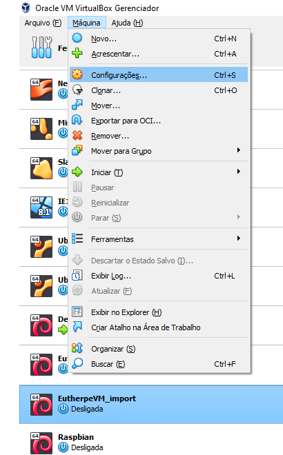

**Figura 6**: Acessando as configurações da `VM`.

Vai abrir a tela presente na **Figura 7**. Vá em `Rede` e verifique se as configurações da
placa de rede estão ok. Para estarem ok é preciso que:

- A opção `Habilitar placa de rede` esteja marcada.
- A configuração `Conectado a` deve estar `Placa em modo Bridge`.
- `Nome` precisa estar o nome da placa que sua máquina física (o seu computador mesmo)
  usa para acessar a rede. No caso do exemplo, o computador acessa uma rede `Wi-Fi`, logo, a placa
  `Wireless` foi selecionada. Se você usa uma conexão cabeada, precisa escolher a placa
  `Ethernet`. Enfim, as placas possíveis estarão na lista, ajuste para o seu estado de coisas.

Com as configurações ok, se você mudou algo (bem provável que sim), clique `OK`.

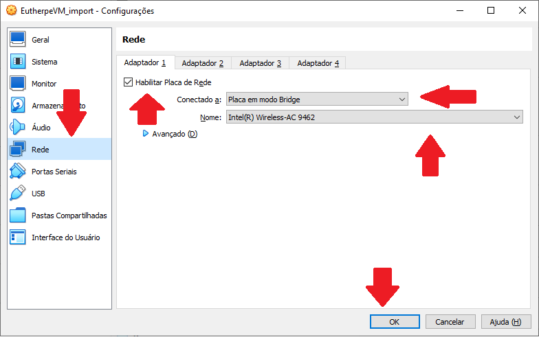

**Figura 7**: Verificando as configurações de rede da `VM`.

Pronto! Agora você só tem que ligar a sua `VM` e depois disso mapear nela a sua placa `Bluetooth` e
o `Pen-drive USB` contendo suas músicas. Para ligar a `VM` deixe ela marcada e vá no menu
`Máquina|Iniciar|Início Normal`. Vide **Figura 8**. Vai demorar um tempinho e depois do `boot`
você vai ver uma tela igual a ilustrada pela **Figura 9**.

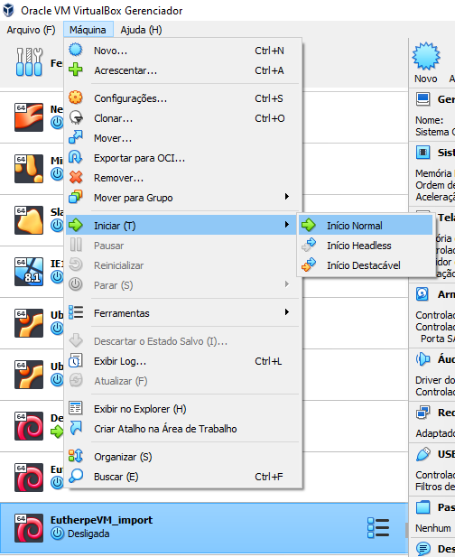

**Figura 8**: Iniciando a `VM Eutherpe`.

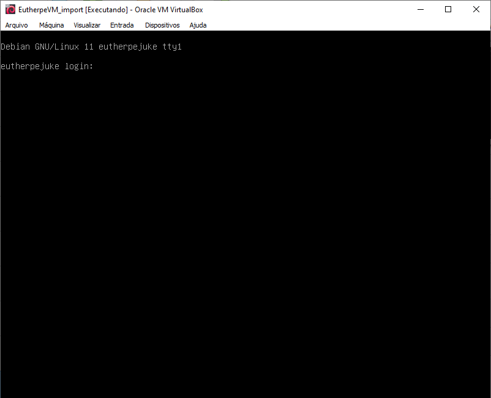

**Figura 9**: A `VM Eutherpe` subiu.

Após isso é necessário deixar a `VM` acessar sua controladora `Bluetooth` e o `USB` com as suas
músicas. Espete o `USB` com as músicas no seu computador. Vá ao menu `Dispositivos|USB`.
Vão ser listados todos os dispositivos que o `Virtualbox` encontrou. No caso do exemplo a
placa `Bluetooth` é a `Intel Corp [0002]` e o `Pen-drive USB` é o `SanDisk Corp. Cruzer Blade [0100]`.
Dê uma olhada na **Figura 10**.

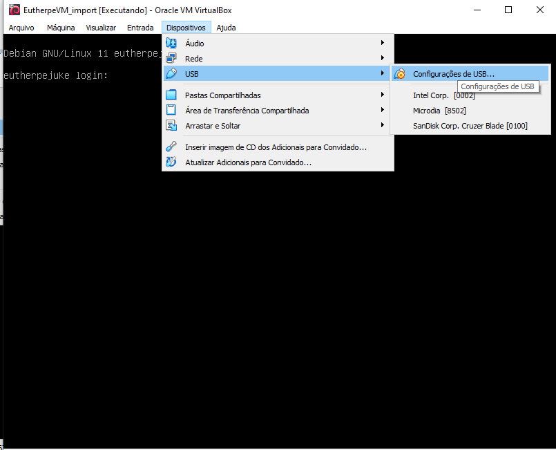

**Figura 10**: Os dispositivos `USB` que podem ser mapeados para a `VM Eutherpe`.

Nisso, eu cliquei nos dois e esperei o `Virtualbox` fazer a mágica dele e mostrá-los selecionados,
conforme a **Figura 11**.

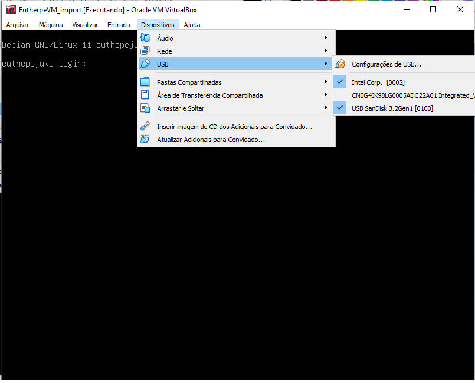

**Figura 11**: `Bluetooth` e `Pen-drive USB` mapeados para a `VM Eutherpe`.

Feito isso, está pronto! Acesse o `miniplayer Eutherpe` via
[`http://eutherpe.local:8080/eutherpe`](http://eutherpe.local:8080/eutherpe) com o seu
`web browser` e é só operá-lo conforme descrito no [manual](MANUAL-PT.md). Confira a **Figura
12**.

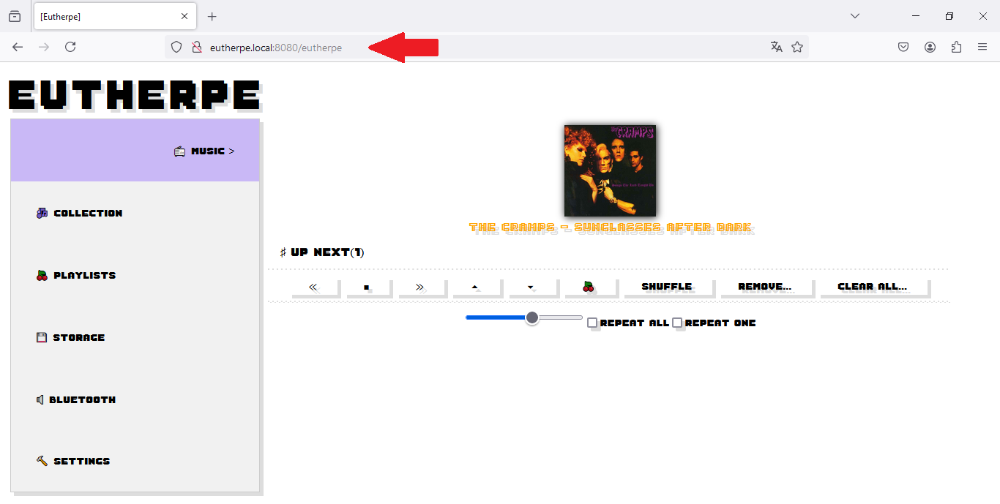

**Figura 12**: :sunglasses:!

> [!IMPORTANT]
> **Observações**:
>
> - Sempre que você ligar a `VM` é necessário mapear o `Bluetooth` e o `Pen-drive`
> `USB`. Enquanto o `Bluetooth` não for iniciado, você não conseguirá acessar o `miniplayer`
> via `Web`.
>
> - Caso precise se logar nessa máquina como usuário `root` a senha é `music`.

Divirta-se! :wink:

[`Voltar`](#tópicos)
